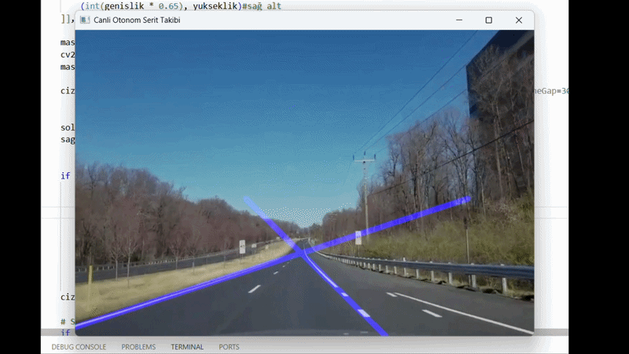

# Autonomous Driving Project 🏎️

This repository contains computer vision applications for autonomous driving, starting from basic lane detection algorithms to simulator integrations.

---

## 📂 Project Structure

* **image_lane_detection:** Detects lane lines from a static highway image using Canny Edge Detection and Hough Transform.
* **lane_detection_system_prototype:** Real-time lane tracking application on dynamic video streams using Line Averaging (Single Line Theorem).

---

## 🛠️ Tech Stack & Dependencies

* Python 3.12
* OpenCV (Computer Vision library)
* NumPy (Mathematical operations)

---

## 🚀 Current Status & Challenges (MVP v2)

The current version (`lane_detection_system_prototype`) successfully tracks solid lines on high-speed roads. 

### Known Issues & Technical Challenges:
* **Dotted Lines:** Intersection noise ("X" shape artifacts) occurs during dotted (dashed) lanes due to slope estimation sensitivity in short pixel segments.
* **Sharp Curves:** The single-line linear equation (y = mx + b) tends to drift when encountering heavy curvature.

---

## 📈 Future Roadmap

- [ ] Add **Temporal Smoothing (Moving Average / Kalman Filter)** to handle dotted lane gaps using previous frame memory.
- [ ] Implement **2nd-Degree Polynomial Fitting** (y = ax^2 + bx + c) for curved lane tracking.
